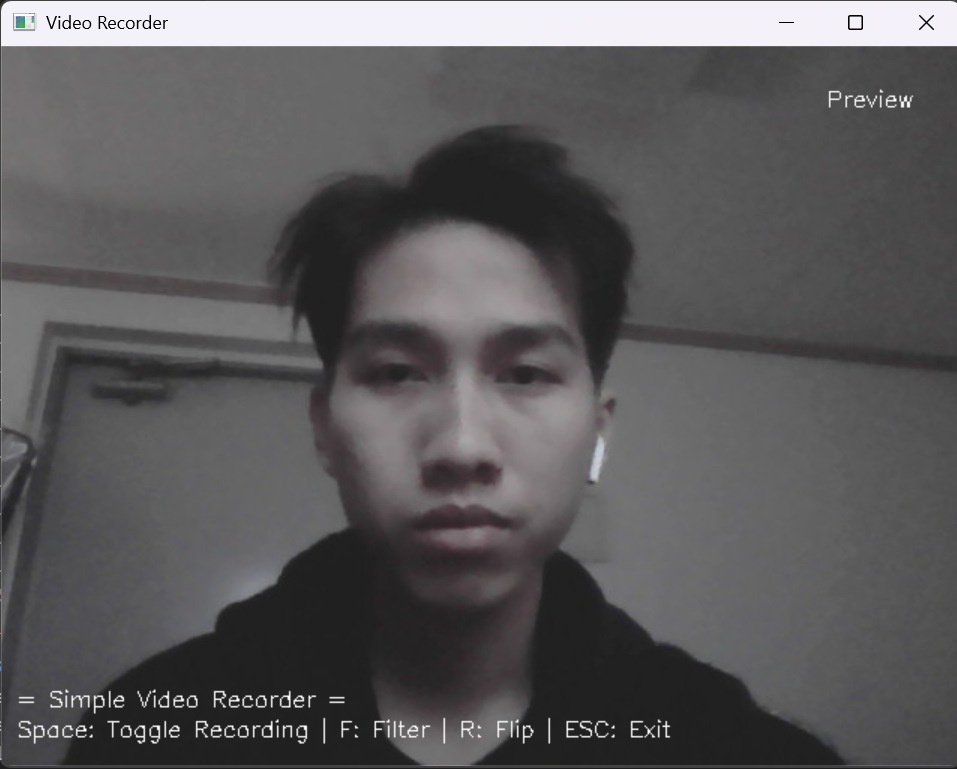

# 🎥 Simple Video Recorder

A simple video recording application using **OpenCV** in Python.  
This program allows users to **preview and record video**, apply filters, flip the video, and save recordings in `.mp4` format.

---

## 🚀 Features
✅ **Preview & Record Video** from your webcam.  
✅ **Save video** in `.mp4` format inside the `recordings/` folder.  
✅ **Recording indicator** (Red circle) and timer display.  
✅ **Apply filters**: Grayscale, Sepia, Edge Detection.  
✅ **Flip video**: Horizontal & Vertical.  
✅ **Hotkeys** for easy control.  

---

## 🔧 Installation
Make sure you have **Python 3.x** installed, then install OpenCV:

```sh
pip install opencv-python numpy
```

---

## ▶️ How to Run
Run the Python script:

```sh
python video_recorder.py
```

---

## 🎮 Controls & Hotkeys
| Key         | Action                                   |
|------------|-----------------------------------------|
| **Space**  | Start/Stop Recording                   |
| **F**      | Change Filter Mode (None → Grayscale → Sepia → Edge) |
| **R**      | Flip Video (None → Horizontal → Vertical) |
| **ESC**    | Exit the Program                        |

---

## 📂 Output & Storage
- Recorded videos are saved inside the `recordings/` folder.  
- The filename format is: `video_YYYYMMDD_HHMMSS.mp4`.  

Example:
```
recordings/video_20250318_143015.mp4
```

---

## 📸 Screenshots


---

## 📜 License
This project is open-source under the **MIT License**.
